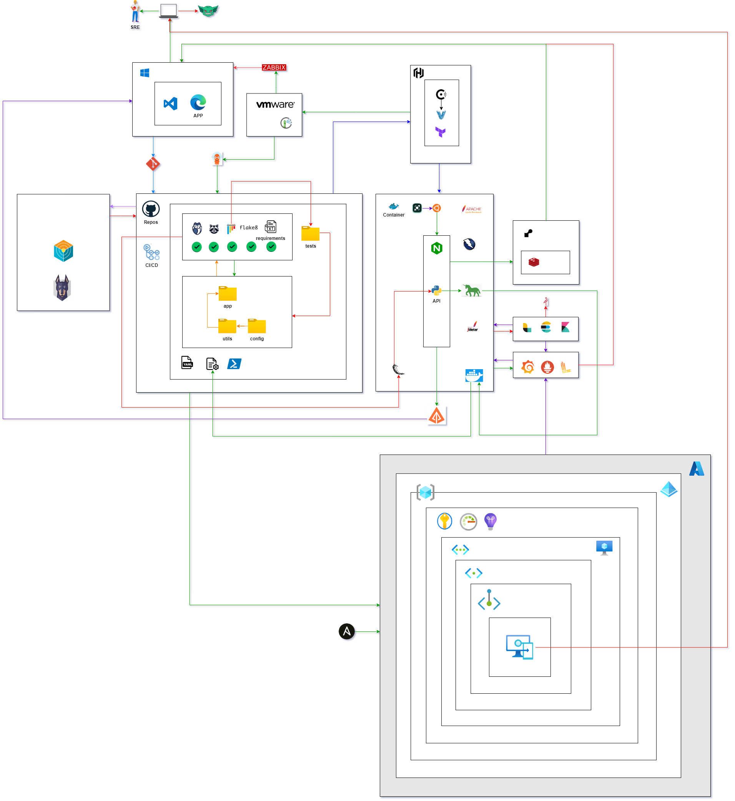

# Architecture Guide

## Contents

- [Architecture Guide](#architecture-guide)
  - [Contents](#contents)
  - [⚙️ System Overview](#️-system-overview)
  - [📊 Diagram](#-diagram)
    - [Components](#components)
  - [🚀 CI/CD Pipeline with Jenkins and Intune Integration](#-cicd-pipeline-with-jenkins-and-intune-integration)
    - [1. **Migrating Jenkins to Intune**](#1-migrating-jenkins-to-intune)
  - [🔐 DevSecOps Best Practices](#-devsecops-best-practices)
    - [🛡️ Key Practices](#️-key-practices)
      - [1. 🔍 Automated Security Testing](#1--automated-security-testing)
  - [🛡️ Automated Security Testing](#️-automated-security-testing)
  - [🛠️ Infrastructure as Code (IaC)](#️-infrastructure-as-code-iac)
    - [PowerShell for Intune Configuration](#powershell-for-intune-configuration)
      - [Example PowerShell script to configure an Intune device policy](#example-powershell-script-to-configure-an-intune-device-policy)
  - [🔑 Secret Management](#-secret-management)
  - [✅ Code Review and Approval Gates](#-code-review-and-approval-gates)
  - [🔎 Security Audits](#-security-audits)
  - [📊 CI/CD Pipeline Monitoring](#-cicd-pipeline-monitoring)
  - [📜 Logging](#-logging)
  - [🔐 Secret Management](#-secret-management-1)
  - [🐳 Docker Versioning](#-docker-versioning)
  - [🎯 General Objectives and Benefits](#-general-objectives-and-benefits)

---

## ⚙️ System Overview

**Target Audience**:
This architecture is designed for development teams leveraging **Intune** for mobile device management (MDM), application management, and endpoint security, integrated with the CI/CD pipeline to enable seamless management of devices throughout the software development lifecycle.

**Use Case**:
The system leverages **Intune** to securely manage mobile devices, ensuring security and compliance through the lifecycle of application deployment, from testing to production, while integrating with CI/CD tools like **Jenkins** to automate deployments.

**DevSecOps Integration**:
DevSecOps practices ensure that security is a core component at every stage of the pipeline, including the management of **Intune** configurations and policies for mobile devices, ensuring that all devices accessing applications are secure and compliant.

---

## 📊 Diagram

- The diagram illustrates how **Intune** is integrated into the CI/CD pipeline, showing how mobile device management, application security, and Jenkins automation interact.



- **Jenkins** triggers deployments and integrates with **Intune** for device and application management and policy enforcement.

- **Intune** manages mobile devices and ensures that applications deployed to them comply with security policies, such as encryption, device compliance checks, and remote wipe capabilities.

- The integration of **Intune** into the pipeline ensures that only compliant devices can access deployed applications.

### Components

1. **Frontend (CI/CD triggers from Jenkins)**: The interface through which users interact with Jenkins, initiating application builds and deployment to managed mobile devices.

2. **Jenkins Server (Azure VM or Azure DevOps)**: Runs Jenkins in a scalable Azure environment, triggering deployment jobs and interacting with **Intune** for device and application management.

3. **Intune**: Provides mobile device management, application deployment, security policies, and compliance checks.

4. **Azure Services**: Supports infrastructure scaling and management but focuses on **Intune** for device management.

---

## 🚀 CI/CD Pipeline with Jenkins and Intune Integration

### 1. **Migrating Jenkins to Intune**

To integrate Jenkins with **Intune**, follow these steps to ensure the mobile device management and application security are streamlined:

- **Jenkins on Azure**: Migrate Jenkins to Azure using **Azure Virtual Machines (VM)** or **Azure DevOps Services**, ensuring that the server is accessible for pipeline execution and mobile device management tasks.
- **Intune Integration**: Leverage **Intune's APIs** to communicate with Jenkins for managing applications and devices. Jenkins will deploy the application, while **Intune** will handle device configurations, app deployments, and compliance policies.
- **Automate Device Compliance Checks**: Automate the process where Jenkins triggers a check of device compliance before deploying applications to **Intune**-managed devices. If devices fail compliance checks, deployment should be halted.

**Sample Jenkins Pipeline**:
Here’s an example of how a Jenkins pipeline could be set up for Intune integration:

  ```groovy
  pipeline {
      agent any
      stages {
          stage('Checkout') {
              steps {
                  checkout scm
              }
          }
          stage('Build') {
              steps {
                  script {
                      sh 'mvn clean install'
                  }
              }
          }
          stage('Deploy to Intune') {
              steps {
                  script {
                      // Integrate Jenkins with Intune for deployment
                      sh './deploy-to-intune.sh'
                  }
              }
          }
          stage('Verify Device Compliance') {
              steps {
                  script {
                      // Check device compliance with Intune before app deployment
                      sh './check-device-compliance.sh'
                  }
              }
          }
      }
  }

  ```

---

## 🔐 DevSecOps Best Practices

DevSecOps integrates security practices into every phase of the development lifecycle, ensuring that **Intune**-managed mobile devices remain secure and compliant during app deployments. By embedding security into the CI/CD pipeline, this approach ensures that vulnerabilities are identified and mitigated early, preventing issues from reaching production.

### 🛡️ Key Practices

#### 1. 🔍 Automated Security Testing

Integrate security tools such as **OWASP ZAP**, **SonarQube**, or **Trivy** into the Jenkins pipeline to perform security scans on both application code and mobile app packages before deployment to **Intune**. This ensures that only secure code and app packages are deployed, minimizing vulnerabilities that could affect device security.

Example Jenkins Pipeline integration with OWASP ZAP:

  ```groovy
  pipeline {
      agent any
      stages {
          stage('Security Test') {
              steps {
                  script {
                      sh 'zap-cli quick-scan --self-contained --url http://your-app-url.com'
                  }
              }
          }
      }
  }

  ```

This automated security testing step helps identify potential security flaws and ensures that applications meet security compliance before being deployed to Intune-managed devices.

---

## 🛡️ Automated Security Testing

This automated security testing step helps identify potential security flaws and ensures that applications meet security compliance before being deployed to **Intune**-managed devices. Integrating security tools like **OWASP ZAP**, **SonarQube**, or **Trivy** into the CI/CD pipeline enables early detection of vulnerabilities, minimizing the risk of exposing sensitive data or violating security policies in production.

By incorporating security testing into the pipeline, developers can address vulnerabilities before deployment, ensuring only secure and compliant code and app packages reach **Intune** devices.

---

## 🛠️ Infrastructure as Code (IaC)

Use **Terraform**, **Azure Resource Manager (ARM)** templates, and **PowerShell** scripts to define and manage **Intune** policies, device configurations, and infrastructure as code. This approach enables consistent, automated security configurations, ensuring all devices are securely configured before deployment.

With **IaC**, you can ensure that the security configurations for **Intune** devices are maintained consistently across environments, reducing human error and configuration drift. This approach allows for automated updates, modifications, and enforcement of security policies across a fleet of devices.

---

### PowerShell for Intune Configuration

You can use **PowerShell** scripts to configure and automate **Intune** device policies, app deployments, and compliance checks. This is particularly useful for managing large-scale deployments and ensuring that security policies are always applied correctly.

Using **PowerShell**, you can automate various tasks such as:

- Configuring device compliance policies
- Deploying apps and updates to **Intune**-managed devices
- Performing regular compliance checks to ensure devices meet security standards

#### Example PowerShell script to configure an Intune device policy

  ```powershell
  # Example: PowerShell script to configure Intune device policy
  $intuneConnection = Connect-MSGraph # Connect to Microsoft Graph for Intune
  Set-IntuneDeviceCompliancePolicy -PolicyName "DevicePolicy" -Platform "Android" -MaxOSVersion "10.0" -EncryptionRequired $true

  ```

This script connects to Microsoft Graph to apply a compliance policy for Intune-managed Android devices. The policy ensures that devices are running a minimum OS version and have encryption enabled, helping to enforce security standards across all managed devices.

---

## 🔑 Secret Management

Securely manage secrets used in Jenkins and Intune configurations (e.g., API keys, passwords) using **Azure Key Vault**, ensuring that sensitive data is protected. **Azure Key Vault** is a cloud service for securely storing and accessing secrets, keys, and certificates. By integrating Azure Key Vault with Jenkins and Intune, secrets can be safely retrieved during the deployment process without exposing them in the code or pipeline logs.

Example:

- Store API keys and credentials in Azure Key Vault.

- Access these secrets during Jenkins pipeline execution using **Azure Key Vault Jenkins Plugin**.

- Ensure all sensitive information is encrypted and stored securely, minimizing the risk of exposure.

---

## ✅ Code Review and Approval Gates

Implement code review processes in Jenkins to ensure that security policies and compliance requirements are considered and validated before deployment to Intune-managed devices. This practice helps enforce **security best practices** and ensures that the code being deployed adheres to predefined standards.

Steps:

- Implement automated code review tools (e.g., **SonarQube**, **Checkmarx**) within Jenkins.

- Create approval gates that require manual or automated reviews before deployment to **Intune**.

- Ensure that only compliant code passes through the pipeline, helping prevent security vulnerabilities and non-compliant applications from reaching production.

---

## 🔎 Security Audits

Integrate **Intune's auditing features** to continuously monitor device compliance and application deployment status. Use **Azure Monitor** for comprehensive logging of actions taken within Jenkins and Intune. This allows for real-time insights into deployment and compliance status, ensuring that the system remains secure.

Example:

- Use **Azure Monitor** to track activities within Jenkins and Intune.

- Leverage **Intune Audit Logs** to review all changes to devices and app deployments.

- Perform continuous audits to ensure that devices remain compliant and security policies are consistently enforced.

---

## 📊 CI/CD Pipeline Monitoring

Monitor the CI/CD pipeline and device compliance status to ensure that no unauthorized applications are deployed to **Intune**-managed devices. Leverage Jenkins plugins for pipeline monitoring and **Azure Monitor** for logging errors or unexpected behaviors.

Steps:

- Use **Jenkins plugins** like **Pipeline: Stage View** to monitor the progress and health of the CI/CD pipeline.

- Integrate **Azure Monitor** to monitor the compliance status of devices and the health of the application deployments.

- Set up alerts for non-compliant devices or deployment failures, ensuring timely intervention before any security issues arise.

---

## 📜 Logging

Ensure all Jenkins build, deploy, and compliance actions are logged. Use **Intune’s logging features** to track application deployment and device compliance, and aggregate these logs for analysis and troubleshooting. **Centralized logging** enables quick identification of issues and provides a history of all actions taken for audit purposes.

Example:

- Enable **Jenkins logging** to capture detailed build and deployment logs.

- Use **Intune logs** to monitor device compliance and track any issues with app deployments.

- Integrate logs into a centralized logging system (e.g., **Azure Log Analytics**) to provide a comprehensive view of the pipeline and device status.

---

## 🔐 Secret Management

Use **Azure Key Vault** for managing credentials used in Jenkins pipelines and **Intune** configurations. This prevents sensitive data from being exposed within the CI/CD pipeline. By securely storing credentials and secrets in Azure Key Vault, you ensure that only authorized users and processes have access to them.

Steps:

- Store Jenkins credentials, API keys, and Intune-related secrets in **Azure Key Vault**.

- Use Jenkins' **Azure Key Vault Plugin** to securely fetch and inject these secrets during pipeline execution.

- Prevent secret leakage by ensuring secrets are never hard-coded into scripts or configuration files.

---

## 🐳 Docker Versioning

For mobile apps deployed via **Intune**, ensure that Docker images used for testing or staging are tagged with version numbers that correlate with app releases. This practice helps maintain a clear and traceable version history for mobile app deployments, improving the ability to track changes and manage the deployment lifecycle.

Steps:

- Use Docker tags to version application images according to their release (e.g., `v1.0`, `v1.1`).

- Ensure that each deployment corresponds to a specific version of the mobile app, ensuring consistency across environments.

- Track versioned Docker images in a **Docker registry** or **Azure Container Registry** for easy retrieval during deployment.

---

## 🎯 General Objectives and Benefits

The objectives of integrating **Intune** into this CI/CD pipeline include:

- **Scalability**: Easily manage the deployment and compliance of applications across numerous devices through **Intune** integration. The solution is designed to scale as the number of devices and app deployments grows.

- **Security**: Maintain a high level of security and compliance, ensuring that mobile devices meet the required standards before deployment. By using **Intune** and automated security checks, you ensure that only secure and compliant apps are deployed.

- **Automation**: Fully automate the process of deploying mobile applications through Jenkins and managing devices with Intune, increasing efficiency and reducing human error. This reduces the time and effort needed to deploy apps and manage devices.

- **Compliance**: Ensure that mobile devices meet all necessary compliance requirements before being allowed to access applications, reducing security risks and ensuring that only trusted devices are granted access to corporate resources.

---
